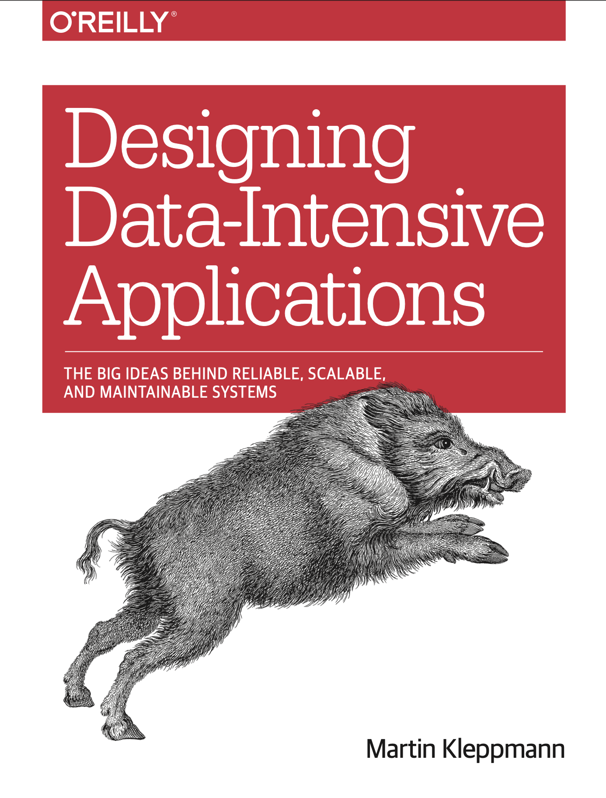

# Design Data Intensive Applications (DDIA)
### The Big Ideas Behind Reliable, Scalable, and Maintainable Systems
- Author: Martin Kleppmann
- Year: 2017
- Cover

- **NOTE: The reading notes covered contents based on my personal interests and understandings, thus I'm not responsible for inaccurate or wrong messages. Comments and feedbacks are welcomed though!**
