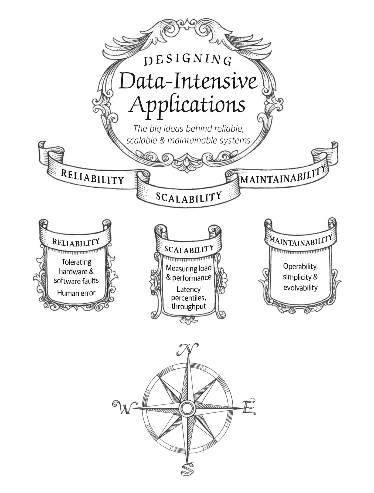

# Reliable, Scalable and Maintainable Applications

## RSM

1. Reliability: 
    1. The system should continue to work correctly, even when things go wrong
2. Scalability: 
    1. As system grows, there should be reasonable ways to handle such growth
3. Maintainability: 
    1. Developers and users of this system should be able to work productively

## Reliability

1. Faults v.s. Failures:
    1. Things that go wrong are faults; the whole system stops becomes a failure. It’s impossible to prevent all faults, so we are focusing on design ************fault-tolerant************ system to prevent faults from causing failures.
    2. Sometimes it makes sense to deliberately inducing faults. E.g. the ****************************************Netflix Chaos Monkey****************************************
2. Hardware faults:
    1. Hard disks are reported to have a mean time to failure of 10 to 50 years, which means for a cluster with 10000 disks we should expect one disk to die per day. Approaches to handle hard disk faults:
        1. Redundant data
        2. RAID configuration
        3. Dual power supplies
        4. Hot-swappable CPUs
        5. …
3. Software errors:
    1. Unlike hardware faults, which are random and independent from each other, software errors could cause much more system failures
    2. Examples:
        1. Leap second on June 30, 2021 and a bug in linux kernel
        2. A runaway process that uses up shared resources
        3. Issues on a service that the system depends on
        4. Cascading failure, where a small fault in one component triggers furtuer faults
    3. These errors mostly lie quitely for a long time and triggered by an unusual set of circumstances because softwares made assumptions which are mostly true but could be wrong under specific situations
4. Human errors:
    1. Humans are unreliable: configuration errors by operators are the leading causes of outages
    2. Some suggestions:
        1. Minimize opportunies for error by carefully design APIs, abstractions and interfaces (make it easy to do “the right thing” and hard to do “the wrong thing”). But there’re trade-offs between reliability and usability
        2. Decouple the places where people could make the most mistakes and the places where can causes failure
        3. Thoroughly test
        4. Allow quick and easy recovery from human errors. E.g. 
            1. make it easy to roll back configuration changes; 
            2. gradually roll out new codes; 
            3. provide tools to recompute data
        5. Detailed and clear monitoring, such as performance metrics and error rates
        6. Good management practices and training (mostly non-tech)

## Scalability

1. Is the ability of a system to cope with increased ********load********
2. Load:
    1. Load parameters. Could be varied depend on the system architecture:
        1. Requests per second to a web server
        2. Ratio of reads to writes in a database
        3. Number of simultaneously active users in a chat room
        4. Hit rate on a cache
        5. …
    2. Take Twitter as an example:
        1. It’s load majorly comes from post tweet and generate home timeline
        2. Two approaches to handle posts and timeline:
            1. Approach 1: 
                1. New tweet: insert directly to a `tweets` table
                Timeline: each time user requests timeline, it looks for all followers and get their tweets from the `tweets` table
                2. Pros: easy to post
                Cons: the load of timeline queries is very large
            2. Approach 2:
                1. New tweet: new tweets are inserted to followers’ timeline cache
                2. Pros: loading of timeline is quick
                Cons: posting is becoming complex; not efficient if a user has lots of followers
            3. Approach 3 (hybrid approach):
                1. For most users use approach 2 to guarantee the efficiency of timeline loading
                2. For users with lots of followers (celebrities), their follower will fetch celebrities’ tweets separately (like approach 1)
3. Performance
    1. How to describe:
        1. Keeping system resource unchanged, how will increased load affect performance?
        2. When load increases, how much resource do we need to increase to keep performance unchanged?
    2. Performance numbers:
        1. For system like **Hadoop**, we care about throughput (e.g. **number of records we can process per second**)
        2. For an **online system**, we care about **response time**, the time between a client sending a request and receiving a response
    3. Latency v.s. Response time:
        1. Latency: the duration that a request is waiting to be handled
        2. Response time: is what the customer sees, time between request initialization and response (includes network delays, queueing delays, service time, etc.)
    4. What’s the best way to measure performance:
        1. Average response time: can be affected by outliers
        2. **Percentiles**: better to understand the “typical” response time. 
            1. Median is p50; 
            2. Tail latencies: high percentiles of response time (slow requests). Important because these directly affect user experience.
            3. **Amazon example**: they describe response time using 99.9th percentile; customers with slowest requests are often those with largest data (thus more valuable)
            4. ******************************************************************SLA (Service Level Agreement)****************************************************************** or ******SLO (Service Level Objective):****** “promised” performance that a cloud provider made to users (e.g. the system will be up at least 99.9% of the time; “up” means median response time less than 200 ms and 99th percentile under 1s).
            5. **Tail latency amplification**: if a request is slow, the client may make multiple requests thus make it even slower
            6. How to monitor performance: 
                1. Naive approach: keep a list of response time and sort every minute
                2. Faster methods to approximate percentile: 
                    1. Forward decay
                    2. t-digest
                    3. HdrHistogram
4. How to cope with load
    1. Scaling up (vertical) v.s. Scaling out (horizontal)
    2. Elastic (automatically scaling) v.s. manual scaling
    3. Stateless and stateful service
        1. Distributing stateless services is easy (stateful is complex)
        2. Thus usually we first scale up a database node until it’s more expensive than scale out (because it’s stateful?) 
    4. System architecture differs based on various application, e.g. 100,000 requests per second (1kb each) v.s. 3 requests per minute (2gb each). It’s same throughput (100mb/s) but the architecture will be different.
    5. When design, it’s important to get correct assumption about which operations are rare and which are common.

## Maintainability

1. 3 principles for good maintainability:
    1. **Operability**: how easy it is for teams to operate the system
    2. **Simplicity**: how easy it is for new engineers to understand the system
    3. **Evolvability**: how easy it is to make changes to adapt unanticipated use cases (also known as *extensibility*, *modifiability*, *plasticity*)
2. Operability:
    1. Importance of operation: 
        1. Good operations can work around the limitation of bad software
        2. Good software cannot run reliably on bad operations
    2. What does operation teams do: 
        1. Monitoring the service, quickly restoring it if it goes to a bad state
        2. Find cause of issues (system failure or degraded performance)
        3. Keeping software up to date
        4. Understand how different systems affect each other and avoid potential issues
        5. Anticipate future problems such as capacity planning
        6. Establish good practices for deployment, configuration management and etc.
        7. Maintaining security
        8. Define processes to make operations predictable and keep prod env stable
        9. Maintain the knowledge of the system within the organization
    3. Good operability means making routine tasks easy, how:
        1. Visibility into system behavior
        2. Good support for automating and integrating tools
        3. Avoid dependency on individual machines
        4. Good documentation
        5. Self-healing + manual administrative control
        6. Fewer surprising behaviors
3. Simplicity:
    1. Symptoms of complexity:
        1. Lots of states
        2. Tight coupling of modules
        3. Tangled dependencies
        4. Inconsistent naming and terminology
        5. Many ad-hoc fixes for specific problems
    2. Accidental complexity: complexity that is not inherent in the problem that the software solves but only for the implementation
    3. Abstraction is the best tool to help remove accidental complexity
        1. Abstraction hides implementation detail and only expose simple interfaces
        2. E.g. high-level programming code abstracts the machine code
        3. But finding good abstraction is very hard
4. Evolvability
    1. Software development in frequently changing env:
        1. Agile dev
        2. Test-driven development
5.
