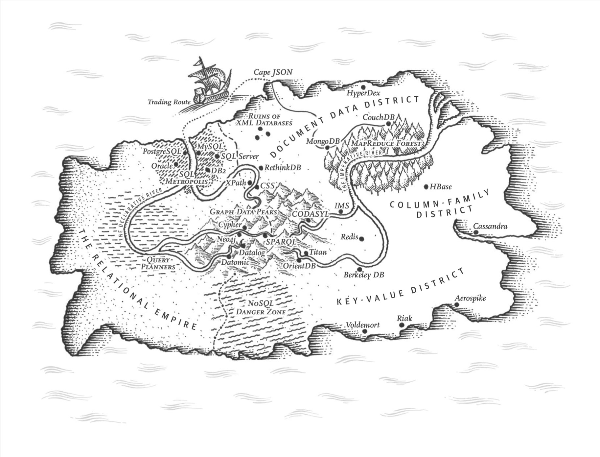

# Data Model and Query Languages



## Introduction

Applications are built by laying one data model on top of another, the key is how to represent the next-lower layer:

- **Application developer**: read world problems → objects or data structures and APIs. Here a general-purpose data model like JSON or XML, relational database tables, graph model is used
- **Database software engineer**: data model like JSON or XML, relational database tables, graph model → bytes in memory/disk/network.
- **********Hardware engineer:********** bytes → electrical currents and other physics

## Relational Model (RM) v.s. Document Model (DM)

************************************Relational model************************************: data is organized into relations and each relation is an unordered collection of tuples (rows)

************************************The birth of NoSQL:************************************

- Need for greater scalability (large dataset, high write throughput)
- Preference for free and open source database products
- Specialized query operations are not well supported by RM
- Tired of the restrictiveness of relational schemas, want more dynamic and expressive data model

**************Object-Relational Mismatch**************

Relational data model is not well-compatible with object-oriented pattern. That’s why we need an additional layer, ORM (object-relational mapping), to do the conversion.

********One-to-Many relationship********

- Traditional SQL model: use foreign key to link multiple (fact table → dimension tables)
- Newer SQL: support structured data type such as XML data, which allows multi-valued data stored in a single row
    - Support XML: Oracle, IBM DB2, MS SQL Server, PostgreSQL
    - Support JSON: IBM DB2, MySQL, PostgreSQL
- Store dimensions in a JSON or XML (like a dictionary). And when data is already a self-contained document, this format is appropriate.
    - Document-oriented DBs: MongoDB, RethinkDB, CouchDB, Espresso
- **If the application has mostly 1toM relationships (tree-structured) or no relationships between records, DM is appropriate.**

**Many-to-One and Many-to-Many relationship**

- Mto1:
    - e.g. industry that a person in or a city that a person lives in
    - Using ID that are not human-readable is better than text
    - The authors talked about normalization and the goal is to remove “human-meaningful” information because such information could lead to inefficient storage of data.
- MtoM: cannot be normalized. Use cases includes add a new feature for users to leave comments.
- MtoM v.s. Mto1 in RM and DM?
    - 1toM works well in DM, but MtoM is difficult because of weak support for join

******************************NoSQL and the history of data model******************************

1. IMS in IBM: hierarchical model, similar to DM, good for 1toM hard for MtoM
    1. Hierarchical model: all records were nested within records, very similar to DM
2. To better support MtoM, RM and network model were proposed
3. **********************The network model:**********************
    1. Generalized hierarchical model: each record may multiple parents
    2. A record is accessed via a path from root along all chained values (a pointer moving along the path)
    3. Querying is complex, difficult to update

****************************************************************Compare RM and DM today****************************************************************

1. Application code easiness: 
    1. DM is Good: If data is organized as document-like structure, it will be suitable. 
    2. DM Drawbacks: not able to directly get items from a document-like structure
    3. DM has Poor join support 
2. Schema flexibility
    1. Schema-on-read (DM) v.s Schema-on-write (RM)
        1. When changing data format, the performance of RM is worse than DM
        2. For DM, just implement the changes starting from next entry
        3. For RM, need to do schema change, which could be very slow
            1. E.g. In MySQL, `ALTER TABLE` copies the whole table
        4. For data with different types, schema-on-read is also better
3. Data locality for queries
    1. DM has locality advantage for relatively small and single files since document is stored as a continuous string
    2. Grouping similar data together is better for locality, this idea is used for both DM and RM
4. Convergence and of DM and RM
    1. RM supports XML and JSON
    2. DM db like RethinkDB, MongoDB supports relational-like joins

## Query Languages for Data

### Declarative v.s. Imparative

1. SQL is a declarative query language for RM: 
    1. Users define the data pattern they want, including what conditions the results must meet and how you want the data to be transformed
2. IMS and CODASYL are imperative languages for RM: Users tells the computer to perform certain operations
3. The author also compared CSS v.s. DOM to display data, an interesting example

### MapReduce programming model

1. It’s neither declarative nor fully imperative
2. It is based on `map`(or collect) and `reduce` (or fold or inject) functions that exists in many programming language
3. Used in distributed executions

## Graph-Like Data Models

- RM can handle simple MtoM relationships, but if the relationships are complex, consider graph model
- A graph consists of vertices and edges
- Typical examples of data that could be modeled as a graph:
    - Social graph
    - Web graph
    - Road or rail networks
- Well-known algorithms:
    - Search for the shortest path between two points
    - PageRank: determine the popularity of a web page
- Graph vertices can be heterogeneous (e.g. vertices represent people, locations, events, etc.)

****Property Graphs****

- The vertices and edges representation follows some rules
- Cypher query language is for property graph

************************Triple-Store************************

- Similar to property graph
- Information is stored in three parts: subject, predicate, object
- E.g. Turtle language
    
    ```
    @prefix : <urn:example:>.
    _:lucy    a     :Person.
    _:lucy    :name    "Lucy".
    _:idaho   :within  _:usa.
    ```
    
- Turtle language can also be written in XML

************************************************************Graph model v.s. Network model************************************************************

- They are different
- Details in p60
-
