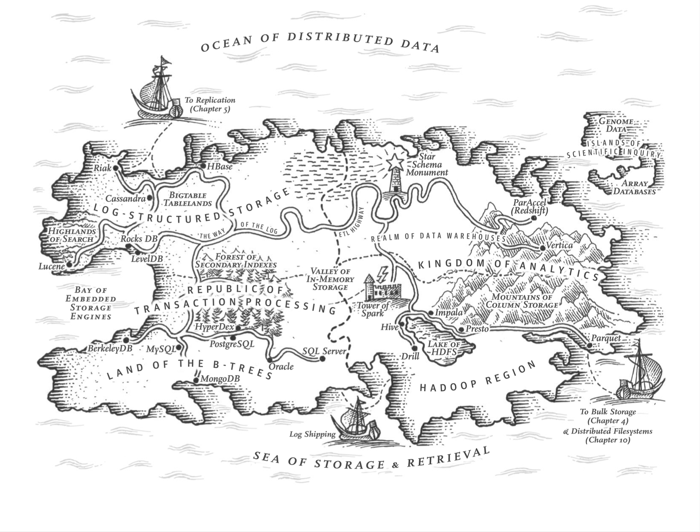

# Storage and Retrieval

## Introduction

1. Database does two things:
    - Give it some data, it stores the data
    - When users ask it for data, it gives back the data (query language)
2. Why we want to know this
    1. Know how to select a storage engine that’s appropriate for the application
    2. Know how to tune the engine to perform well on needed workload
3. Will introduce two families of storage engine
    1. log-structured
    2. page-oriented

## Data Structures that Power Your Database

- From the simplest database example (2-line bash), the author introduced ***log***, which in this book means an “append-only sequence of records”
- Naive approach scan the whole database to find a record, ***index*** is introduced to improve the performance
    - An important trade-off: index slows down writes, speed up reads

### Hash Indexes

It’s a key-value store

- In-memory: key + byte offset
- On disk log-structured file (append-only): find key directly according to byte offset
- Bitcask (the default storage engine in Riak) uses this
- All indexes lives in memory
    - Good for applications where ***the value for each key is updated frequently***: e.g. used to store the number of times a video was played
    - Not too many distinct keys so they fit in memory
- To avoid disk space run out, we can
    - Break the log into segments of a certain size
    - Perform compaction on the segments, meaning removing duplicate keys
    - Then merge several compacted segments together
    - Once done, direct read to new segments and delete old segments
- Issues in read implementation
    - **File format**: string in bytes is preferred compare to csv
    - How to **delete record**: append a special deletion record, and tell the merging process to delete values of the deleted key
    - **Crash recovery**: In memory hash map will be lost if database is restarted. We can recover log by scan the whole disk which is slow. Bitcask stores snapshot of each segment’s hash map on disk for faster recovery
    - **Partially written records**: Could happen in crash. Bitcask files include checksums which allow corrupted parts of the log to be deleted and ignored
    - **************************************Concurrency control**************************************: only one write thread is allowed, multiple read threads are fine since log is read-only and immutable
- Advantages:
    - Fast
    - Concurrency and crash recovery are simple
    - Merging avoids data files getting fragmented over time
- Limitations:
    - Hash table must fit in memory: On-disk hash table won’t work well because hash tables requires a lot of I/O access. Also hash collision is a problem if we have a very large hash table
    - Inefficient range queries: you cannot scan a range of keys without checking hash map for each individual key

### SSTables and LSM-Tree

### B-Trees

### Other indexing structures

## Transaction processing or analytics?
### Data Warehousing

### Starts and Snowflakes: Schemas for analytics

## Column-oriented storage
